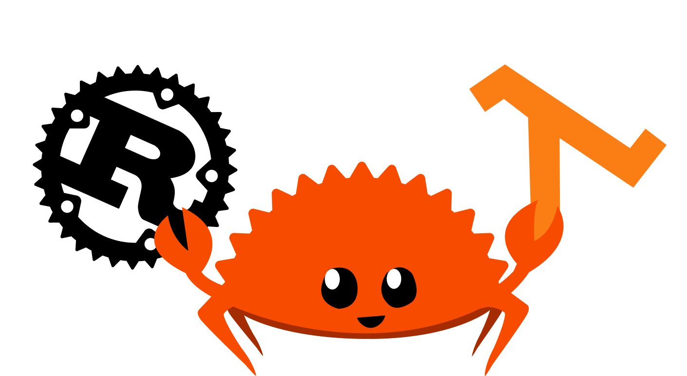

<h1 align="center">
  <br>
  <a href="https://github.com/gcatabr1/project-lambda-rust/blob/main"></a>
  <br>
  Rusty JSON Flattener
  <br>
</h1>

<h4 align="center">JSON to Hash / Vec (flatteners) in <a href="https://www.rust-lang.org" target="_blank">Rust</a>.</h4>

<p align="center">
  <a href="https://img.shields.io/badge/maintained-yes-blue"></a>
    
  </a>
  <a href="https://www.rust-lang.org/" title="Go to Rust homepage"></a>
</p>

<p align="center">
  <a href="#key-features">Key Features</a> •
  <a href="#how-to-run">How To Run</a> •
  <a href="#credits">Credits</a> •
  <a href="#related">Related</a> •
  <a href="#license">License</a>
</p>


## Key Features

This repo is my attempt to learn Rust - by adapting an existing [hashing] algorithm coded up in Python. To learn Rust language basics, how to use and configure Cargo, organizing your dev folders and create and run tests; as well compare Rust performance to Python.

The main function runs each of the functions using one of the test_data JSON files and then prints out the duration of each function in microseconds (see image above).

About the 3 algorithms, which are all variants of each other:
* each algorithm hashes (or flattens) a JSON
* the hashing functions create a unique key for each value, based on the existing key and parent keys, thus taking out the levels of a JSON (see image above)
* recursive function does the hashing recursively using the std HashMap object
* the non-recursive function does this, using HashMap, but not recursively
* the non-recursive vec function does this without using a HashMap, but instead, using a Vec
* went in thinking the performance would be, from fastest to slowest: non-recursive vec, non-recursive, recursive
* but found, with a large JSON, that it was instead: non-recursive vec, recursive, and non-recursive.
* each function (algorithm) can be found in the 'flatteners' folder 


## How To Run

To run the code, first clone the repository and then perform any of the following:

```
# fastest way to just see the output
> cargo run
```

```
# if you want to see the functions run in release mode
> cargo run -r
```

```
# if you want to the tests
> cargo run test
```


> **Note**
> If you want to try other test_data JSON, then change the first assignment lines in main()
>   *let input_file = "test_data/lambda_project_testdata_long_allyears.json";*
>   *let output_file_recurs = "json_hash_output_allyears_recurs_rust.json";*
>   *let output_file_nonrecurs = "json_hash_output_allyears_nonrecurs_rust.json";*  
>   *let output_file_nonrecurs_vec = "json_hash_output_allyears_nonrecurs_vec_rust.json";*        
    


## Credits

This software uses the following open source packages:

- [Rust](https://www.rust-lang.org)

## Related


## Support


## License

MIT

---


